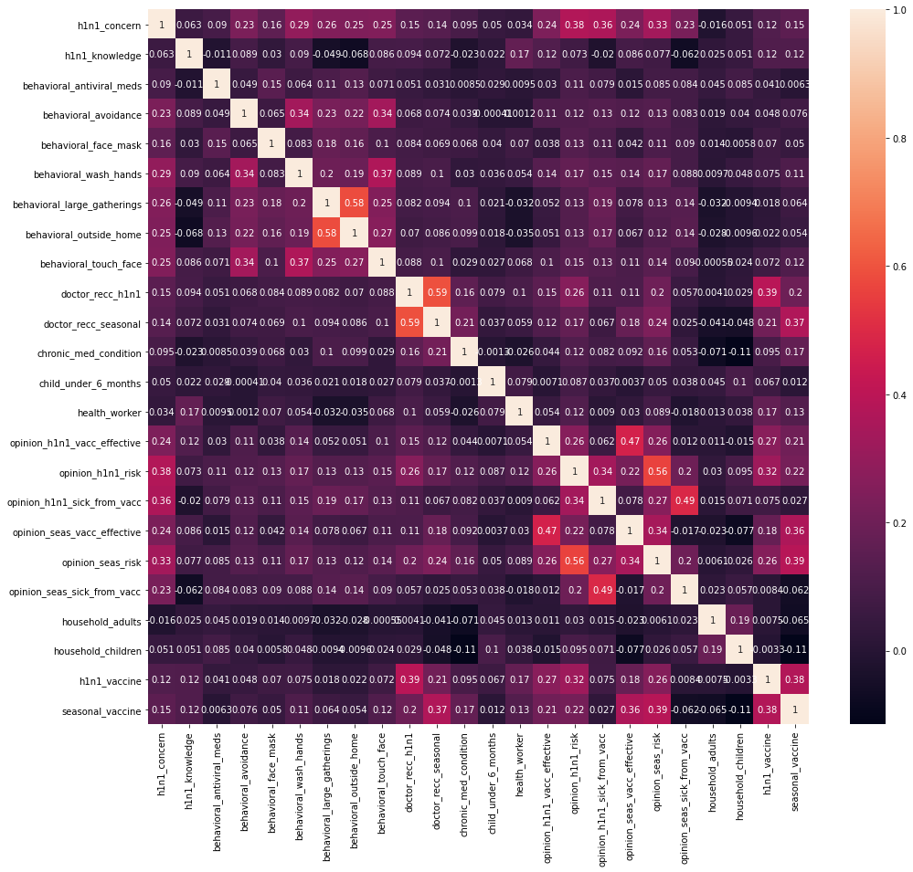

# H1N1 and Seasonal Flu Vaccines

**Authors**: Ian Butler, Red the dog

## Overview

Can we predict whether people got H1N1 and seasonal flu vaccines using data collected in the National 2009 H1N1 Flu Survey?

A one-paragraph overview of the project, including the problem, data, methods, results and recommendations:

In this project, we will be attempting to address the following problem: how can we increase innoculation rates in the population against H1N1 and other highly infectious respiratory diseases? To answer this question, we will be looking at data from the National 2009 H1N1 Flu Survey using simple data exploration, data analysis, and data modeling algorithms like Logistic Regression and Random Forests. Ultimately, we find that we can predict H1N1 vaccination status accurately 85% of the time using a Logistic Regression model and that the three most significant features for guiding this prediction are whether or not a respondent was vaccinated against the seasonal flu that year, whether or not the H1N1 vaccine was reccommended to them by a doctor, and whether or not that believe that the H1N1 vaccine is effective. Based on these results, we reccommend that public health officials increase education about how and why seasonal flu vaccination works, partner with doctors and other medical professionals to leverage their leadership in their local communities, and provide robust documentation to the public with respect to how and why this specific vaccine against H1N1 works.

## Objectives

Summary of the problem we are trying to solve, and the data questions that we plan to answer to solve them.

***

Questions to consider:

* What are the organization's pain points related to ths project?
    * The organization's pain points related to this project are these:
        * **Primary**: can we predict whether people got H1N1 vaccines using data collected in the National 2009 H1N1 Flu Survey?
        * **Secondary**: can we infer which variables of this survey are most causing a change in vaccination status for H1N1?
        * **Tertiary**: can we provide actionable recommendations to improve the rate of innoculation against H1N1?
* How did we pick the data analysis question(s) that we did?
    * With respect to each of the above questions, we picked the questions as a result of the following thought process:
        * Ultimately, what we would like to be able to do is increase the population's rate of innoculation against highly infectious respiratory diseases. In order to know what would have to be done to take action in this way, we have to understand what variables are most causing a change in vaccination status for individuals, as well as which of those variables we can actually control. Finally, we can confirm whether or not our understanding of these relationships can be used to accurately predict vaccination status for individuals.
* Why are these questions important from the organization's perspective?
    * These questions are important from the organization's perspective because they allow public health officials to make informed decisions about what actions they can take to attempt to improve the resiliency of the population against highly infectious respiratory diseases.

***

## Data Understanding

Describe the data being used for this project.

***

Questions to consider:

* Where did the data come from?
    * The data comes from the National 2009 H1N1 Flu Survey.
* How do they relate to the data analysis questions?
    * The National 2009 H1N1 Flu Survery relates to the data analysis questions in that this survey was specifically designed to develop an understanding of how people’s backgrounds, opinions, and health behaviors are related to their personal vaccination patterns.
* What do the data represent?
    * Each entry in the data represents the survey responses of one individual.
* Who is in the sample?
    * The sample is comprised of individuals from various psychographics and demographics across the United States.
* What variable are includeed?
    * The variables included are as follows:
    * For all binary variables: 0 = No; 1 = Yes.
        * **respondent_id**
            * a unique and random identifier
        * **h1n1_concern** - Level of concern about the H1N1 flu.
            * 0 = Not at all concerned;
            * 1 = Not very concerned;
            * 2 = Somewhat concerned;
            * 3 = Very concerned.
        * **h1n1_knowledge** - Level of knowledge about the H1N1 flu.
            * 0 = No knowledge;
            * 1 = A little knowledge;
            * 2 = A lot of knowledge.
        * **behavioral_antiviral_meds** - Has taken antiviral medications.
            * (binary)
        * **behavioral_avoidance** - Has avoided close contact with other with flu-like symptoms.
            * (binary)
        * **behavioral_face_mask** - Has bought a face mask.
            * (binary)
        * **behavioral_wash_hands** - Has frequently washed hands or used hand sanitizer.
            * (binary)
        * **behavioral_large_gatherings** - Has reduced time at large gatherings.
            * (binary)
        * **behavioral_outside_home** - Has reduced contact with people outside of own household.
            * (binary)
        * **behavioral_touch_face** - Has avoided touching eyes, nose, or mouth.
            * (binary)
        * **doctor_recc_h1n1** - H1N1 flu vaccine was recommended by doctor.
            * (binary)
        * **doctor_recc_seasonal** - Seasonal flu vaccine was recommended by doctor.
            * (binary)
        * **chronic_med_condition** - Has any of the following chronic medical conditions: asthma or an other lung condition, diabetes, a heart condition, a kidney condition, sickle cell anemia or other anemia, a neurological or neuromuscular condition, a liver condition, or a weakened immune system caused by a chronic illness or by medicines taken for a chronic illness.
            * (binary)
        * **child_under_6_months** - Has regular close contact with a child under the age of six months.
            * (binary)
        * **health_worker** - Is a healthcare worker.
            * (binary)
        * **health_insurance** - Has health insurance.
            * (binary)
        * **opinion_h1n1_vacc_effective** - Respondent's opinion about H1N1 vaccine effectiveness.
            * 1 = Not at all effective;
            * 2 = Not very effective;
            * 3 = Don't know;
            * 4 = Somehwat effective;
            * 5 = Very effective.
        * **opinion_h1n1_risk** - Respondent's opinion about risk of getting sick with H1N1 flu without vaccine.
            * 1 = Very low;
            * 2 = Somewhat low;
            * 3 = Don't know;
            * 4 = Somewhat high;
            * 5 = Very high.
        * **opinion_h1n1_sick_from_vacc** - Respondent's worry about getting sick from taking H1N1 vaccine.
            * 1 = Not at all worried;
            * 2 = Not very worried;
            * 3 = Don't know;
            * 4 = Somewhat worried;
            * 5 = Very worried.
        * **opinion_seas_vacc_effective** - Respondent's opinion about seasonal flu vaccine effectiveness.
            * 1 = Not at all effective;
            * 2 = Not very effective;
            * 3 = Don't know;
            * 4 = Somehwat effective;
            * 5 = Very effective.
        * **opinion_seas_risk** - Respondent's opinion about risk of getting sick with seasonal flu without vaccine.
            * 1 = Very low;
            * 2 = Somewhat low;
            * 3 = Don't know;
            * 4 = Somewhat high;
            * 5 = Very high.
        * **opinion_seas_sick_from_vacc** - Respondent's worry about getting sick from taking seasonal flu vaccine.
            * 1 = Not at all worried;
            * 2 = Not very worried;
            * 3 = Don't know;
            * 4 = Somewhat worried;
            * 5 = Very worried.
        * **age_group** - Age group of respondent.
        * **education** - Self-reported education level.
        * **race** - Race of respondent.
        * **sex** - Sex of respondent.
        * **income_poverty** - Household annual income of respondent with respect to 2008 Census poverty thresholds.
        * **marital_status** - Marital status of respondent.
        * **rent_or_own** - Housing situation of respondent.
        * **employment_status** - Employment status of respondent.
        * **hhs_geo_region** - Respondent's residence using a 10-region geographic classification defined by the U.S. Dept. of Health and Human Services. Values are represented as short random character strings.
        * **census_msa** - Respondent's residence within metropolitan statistical areas (MSA) as defined by the U.S. Census.
        * **household_adults** - Number of *other* adults in household, top-coded to 3.
        * **household_children** - Number of children in household, top-coded to 3.
        * **employment_industry** - Type of industry respondent is employed in. Values are represented as short random character strings.
        * **employment_occupation** - Type of occupation of respondent. Values are represented as short random character strings.
* What is the target variable?
    * There are two target variables in this dataset:
        * **h1n1_vaccine** - Whether respondent received H1N1 flu vaccine.
        * **seasonal_vaccine** - Whether respondent received seasonal flu vaccine.
    * **This project will focus on the h1n1_vaccine target, specifically.**
* What are the properties of the variables you intend to use?
    * We intend to use all of the available variables, at least until any given variable is shown to be statistically insignificant.
    * Most of the variables have numeric data types and will likely be left as-is. The variables which do not have numeric data types will likely be transformed using ordinal encoding or one hot encoding, as appropriate.

***

The above descriptions of the features in this dataset were taken from DrivenData at the following URL:

https://www.drivendata.org/competitions/66/flu-shot-learning/page/211/#features_list

The 10 HHS geographic classification regions:


The above image was taken from the U.S. Department of Health and Human Services at the following URL:

https://www.hhs.gov/about/agencies/iea/regional-offices/index.html

A brief word on MSA:

The United States Office of Management and Budget (OMB) delineates metropolitan and micropolitan statistical areas according to published standards that are applied to Census Bureau data. The general concept of a metropolitan or micropolitan statistical area is that of a core area containing a substantial population nucleus, together with adjacent communities having a high degree of economic and social integration with that core. Currently delineated metropolitan and micropolitan statistical areas are based on application of 2010 standards (which appeared in the Federal Register on June 28, 2010) to 2010 Census and 2011-2015 American Community Survey data, as well as 2018 Population Estimates Program data. Current metropolitan and micropolitan statistical area delineations were announced by OMB effective March 2020.

The above excerpt on MSA was taken from the United States Census Bureau at the following URL:

https://www.census.gov/programs-surveys/metro-micro/about.html

## Methods

Describe the process for analyzing or modeling the data.

***

Questions to consider:

* How did you prepare, analyze or model the data?
    * We prepared the data in the following ways:
        * Dropped variables which were either missing half of their values or more than 10% of their values, with no good answer for imputing new values:
            * health_insurance
            * employment_industry
            * employment_occupation
            * income_poverty
        * Executed a OneHotEncoder for all features of the object data type. Given that there was no inherent rank to any of the object features, a OneHotEncoder was applied universally to those data types in lieu of using an OrdinalEncoder for any of them.
    * We analyzed the data in the following ways:
        * Simple dataframe manipulation:
            * Observed measures of central tendency for varioues features
            * Observed distribution of the features and of the target
            * Observed correlation of features to target and features to features
        * Visualized correlation of features and target via heatmapping
    * We modeled the data with the following algorithms:
        * Dummy Classifier
        * Logistic Regression
        * Random Forest
* Why is this approach appropriate given the data and the problem?
    * The approaches were appropraite given the data and the problem because they allowed us to eliminate features which could not rightly contribute toward the inference or prediction of the target without arbitrarily skewing the distribution of those features.
***

## Results

***



Looking at this heatmap, we can see a few interesting things:

* First, based on the gradient of the legend at the right, we can see that no feature or target negatively correlates to any other feature or target by a coefficient of -0.2 or lower, so we can say that no feature or target has a high negative correlation with any other feature or target.
* Second, there are no features or targets that have a correlation with h1n1_vaccine above 0.5, so we can say that no feature or target has a strong relationship with h1n1_vaccine.
* Third, there are three features with have a correlation with h1n1_vaccine greater than 0.3:
    * doctor_recc_h1n1
        * H1N1 flu vaccine was recommended by doctor. (binary)
    * opinion_h1n1_risk
        * Respondent's opinion about risk of getting sick with H1N1 flu without vaccine. (ordinal)
    * seasonal_vaccine
        * Whether respondent received seasonal flu vaccine. (binary)
    * Based on these correlations, we can say that there may be a moderate relationship between these features and the target. However, in order to know whether or not this correlation is causative, we will need to explore these relationships in our modeling process. As we know, correlation does not necessarily mean causation; it just gives us some insight into what we may want to explore.
* Finally, there are several feature which have correlations higher than 0.5:
    * behavioral_large_gatherings and behavioral_outside_home
    * doctor_recc_h1n1 and doctor_recc_seasonal
    * opinion_h1n1_risk and opinion_seas_risk
    * Based on this level of correlation, there may be a level of multicollinearity between these variables, but this is also something to explore during model iteration. We'll simply keep this in mind for now.

***


Based on the above image of the distribution of the target class, we can easily see that the target is imbalanced in favor of 0 - the respondent did not get the H1N1 Flu Vaccine. With this in mind, a baseline model will likely have a reasonable level of accuracy, which is something we will keep in mind in model iteration.

***

Our most successful model in the iterations we ran of a Dummy Classifier, Logistic Regressions, and Random Forests was a Logistic Regression with the default hyperparameters. This model produced results with the following evaluation metrics:
* Accuracy: 85%
* Precision: 70%
* Recall: 51%
* F1 Score: 59%


Based on the above image of the feature importance of this model, we can see that the three most influental features in predicting whether or not an individual will get the vaccine for the H1N1 flu are these:
1. seasonal_vaccine
2. doctor_recc_h1n1
3. opinion_h1n1_vacc_effective

***

## Conclusions

***
Questions to consider:
* What would you recommend the stakeholder do as a result of this work?
    * As a result of this project, we would recommend that public health officials observe the following steps:
        1. Educate the general population on how and why the seasonal flu vaccine works.
        2. Partner with doctors and other medical professionals to encourage them to encourage their patients to get vaccinated, as their reccomendations directly contribute to the number of people getting the vaccine.
        3. Provide robust documentation to the population on how and why this specific vaccine for H1N1 works. In addition to understanding how and why vaccines against influenza work in the first place, believing that this specific vaccine also works is a critical element in the decision of an individual to get it or not.
* What are some reasons why your analysis might not fully solve the problem?
    * The number one reason why this analysis might not fully solve the problem is this:
        * Despite iterations on multiple models, our best model still presents with a fairly low recall. This may indicate that there are inderlying details in the understanding of how people’s backgrounds, opinions, and health behaviors are related to their personal vaccination patterns that this survey is not picking up on.
* What else could you do in the future to improve this project?
    * Moving forward, we would like to expand the model iteration process to include even more robust models like XGBoost.
***

## For More Information

Please review our full analysis in [our Jupyter Notebook](./h1n1-and-seasonal-flu-vaccines.ipynb) or our [presentation](./H1N1-and-Seasonal-Flu-Vaccines.pdf).

For any additional questions, please contact **Ian Butler ianbutleremail@gmail.com**

## Repository Structure

```
├── README.md                                    <- The top-level README for reviewers of this project
├── h1n1-and-seasonal-flu-vaccine.ipynb          <- Narrative documentation of analysis in Jupyter notebook
├── H1N1 and Seasonal Flu Vaccines.pdf           <- PDF version of project presentation
├── data                                         <- Sourced externally
└── images                                       <- Both sourced externally and generated from code
```
